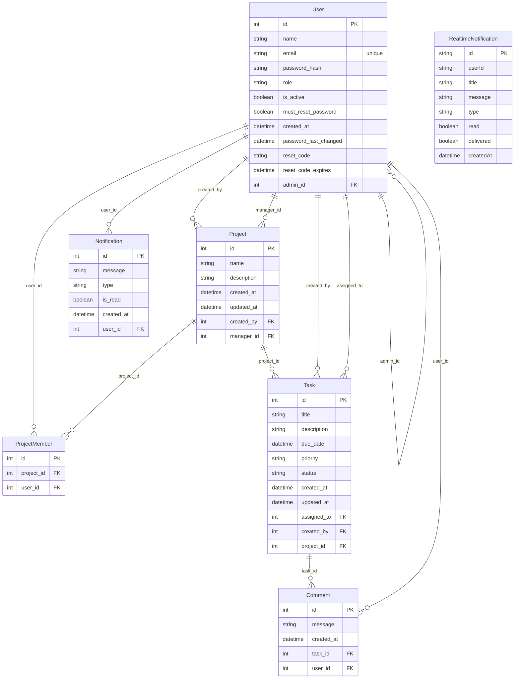

# 🗄️ Task Management System (TMS) 


---

## 1. 📊 Visual Entity Relationship Diagram (ERD)



---

## 2. 📚 Complete Table & Data Dictionary


### 1. `User` Table (Core Authentication & RBAC Hierarchy)
Stores all corporate identities, password security metadata, and multi-tenant workspace relationships.

| Column Name | Data Type | Nullable | Constraints & Defaults | Engineering Rationale (*WHY* it exists) |
| :--- | :---: | :---: | :--- | :--- |
| **`id`** | `Int` | No | **Primary Key**, Autoincrement | Sequential integer identifier indexing user joins rapidly. |
| **`name`** | `String` | No | Non-Nullable | Display name rendered on UI dashboard cards and avatar initials. |
| **`email`** | `String` | No | **Unique** | Corporate login handle; uniqueness prevents duplicate account registrations. |
| **`password_hash`** | `String` | No | Non-Nullable | Bcrypt cryptographic hash (never plain text) verifying authentication. |
| **`role`** | `String` | No | Default: `"COLLABORATOR"` | RBAC privilege guard (`ADMIN`, `PROJECT_MANAGER`, `COLLABORATOR`). |
| **`is_active`** | `Boolean`| No | Default: `true` | Instant kill-switch allowing Admins to lock out terminated employees. |
| **`must_reset_password`**| `Boolean`| No| Default: `false` | Intercepts navigation on onboarding to force temporary password updates. |
| **`created_at`** | `DateTime`| No | Default: `now()` | Audit timestamp recording user registration date. |
| **`password_last_changed`**|`DateTime`| Yes| Nullable | Throttles password updates to enforce a 1-change-per-30-days policy. |
| **`reset_code`** | `String` | Yes| Nullable | 6-digit random integer sent via email during Forgot Password flows. |
| **`reset_code_expires`**| `DateTime`| Yes| Nullable | 15-minute expiration timestamp validating the recovery code. |
| **`admin_id`** | `Int` | Yes| **Foreign Key** $\rightarrow$ `User.id` | **Workspace Tree ID**: Links PMs/Collaborators to their parent Admin workspace. |

---

### 2. `Project` Table (High-Level Task Grouping)
Organizes tasks into distinct project containers managed by specific Project Managers.

| Column Name | Data Type | Nullable | Constraints & Defaults | Engineering Rationale (*WHY* it exists) |
| :--- | :---: | :---: | :--- | :--- |
| **`id`** | `Int` | No | **Primary Key**, Autoincrement | Unique project identifier referenced in API route parameters. |
| **`name`** | `String` | No | Non-Nullable | Project title displayed on dashboard navigation cards. |
| **`description`**| `String` | Yes| Nullable | High-level summary of project goals and scope. |
| **`created_at`** | `DateTime`| No | Default: `now()` | Timestamp tracking project initiation date. |
| **`updated_at`** | `DateTime`| No | `@updatedAt` | Auto-managed timestamp reflecting the last time project metadata changed. |
| **`created_by`** | `Int` | No | **Foreign Key** $\rightarrow$ `User.id` | Tracks which Admin or PM originally instantiated the project. |
| **`manager_id`** | `Int` | No | **Foreign Key** $\rightarrow$ `User.id` | Designated Project Manager authorized to edit project fields and tasks. |

---

### 3. `ProjectMember` Table (Many-to-Many Enrollment Junction)
Resolves many-to-many enrollments between Collaborators and Projects.

| Column Name | Data Type | Nullable | Constraints & Defaults | Engineering Rationale (*WHY* it exists) |
| :--- | :---: | :---: | :--- | :--- |
| **`id`** | `Int` | No | **Primary Key**, Autoincrement | Unique record ID for junction row management. |
| **`project_id`** | `Int` | No | **FK** $\rightarrow$ `Project.id` `[Cascade]`| Parent project. Deleting project cascades deletion of memberships. |
| **`user_id`** | `Int` | No | **FK** $\rightarrow$ `User.id` `[Cascade]`| Enrolled collaborator. |
| *(Table Constraint)*| — | — | `@@unique([project_id, user_id])` | **Composite Unique**: Prevents enrolling the same user into a project twice. |

---

### 4. `Task` Table (Core Work Execution Unit)
The central operational entity of the Kanban board.

| Column Name | Data Type | Nullable | Constraints & Defaults | Engineering Rationale (*WHY* it exists) |
| :--- | :---: | :---: | :--- | :--- |
| **`id`** | `Int` | No | **Primary Key**, Autoincrement | Unique task ID referenced in drag-and-drop state updates. |
| **`title`** | `String` | No | Non-Nullable | Mandatory task title rendered on Kanban cards. |
| **`description`**| `String` | Yes| Nullable | Detailed markdown specifications or acceptance criteria. |
| **`due_date`** | `DateTime`| Yes| Nullable | Target deadline; validated against past dates on creation. |
| **`priority`** | `String` | No | Default: `"MEDIUM"` | Urgency tier (`LOW`, `MEDIUM`, `HIGH`) determining UI badge colors. |
| **`status`** | `String` | No | Default: `"TODO"` | Workflow state (`TODO`, `IN_PROGRESS`, `COMPLETED`) mapping board columns. |
| **`created_at`** | `DateTime`| No | Default: `now()` | Task creation audit timestamp. |
| **`updated_at`** | `DateTime`| No | `@updatedAt` | Tracks last modification for team activity sorting. |
| **`assigned_to`**| `Int` | Yes| **FK** $\rightarrow$ `User.id` | Collaborator responsible for executing and updating task status. |
| **`created_by`** | `Int` | No | **FK** $\rightarrow$ `User.id` | Author who instantiated the task. |
| **`project_id`** | `Int` | Yes| **FK** $\rightarrow$ `Project.id` `[Cascade]`| Parent project container. Deleting project purges child tasks. |

---

### 5. `Comment` Table (Task Collaboration & Mentions)
Stores team discussions attached to specific tasks.

| Column Name | Data Type | Nullable | Constraints & Defaults | Engineering Rationale (*WHY* it exists) |
| :--- | :---: | :---: | :--- | :--- |
| **`id`** | `Int` | No | **Primary Key**, Autoincrement | Unique comment identifier. |
| **`message`** | `String` | No | Non-Nullable | Discussion text; scanned via regex on insert for `@mentions`. |
| **`created_at`** | `DateTime`| No | Default: `now()` | Chronological sorting timestamp for discussion threads. |
| **`task_id`** | `Int` | No | **FK** $\rightarrow$ `Task.id` `[Cascade]`| Parent task. Purging a task purges all associated discussion threads. |
| **`user_id`** | `Int` | No | **FK** $\rightarrow$ `User.id` | Author who posted the comment. |

---

### 6. `Notification` Table (PostgreSQL Persistent Audit Trail)
Permanent relational notification log bound to user accounts.

| Column Name | Data Type | Nullable | Constraints & Defaults | Engineering Rationale (*WHY* it exists) |
| :--- | :---: | :---: | :--- | :--- |
| **`id`** | `Int` | No | **Primary Key**, Autoincrement | Notification log ID. |
| **`message`** | `String` | No | Non-Nullable | Alert description (e.g., *"Task assigned to you"*). |
| **`type`** | `String` | No | Non-Nullable | Category indicator (`ASSIGNMENT`, `COMMENT`, `SYSTEM`). |
| **`is_read`** | `Boolean`| No | Default: `false` | Unread badge indicator for UI notification bell dropdowns. |
| **`created_at`** | `DateTime`| No | Default: `now()` | Alert dispatch timestamp. |
| **`user_id`** | `Int` | No | **FK** $\rightarrow$ `User.id` | Target recipient account. |

---

### 7. `RealtimeNotification` Table (`realtime_notifications` Microservice Buffer)
Uncoupled buffer schema engineered for Socket.io offline message delivery.

| Column Name | Data Type | Nullable | Constraints & Defaults | Engineering Rationale (*WHY* it exists) |
| :--- | :---: | :---: | :--- | :--- |
| **`id`** | `String` | No | **PK**, `@default(uuid())` | String UUID preventing collision across microservice event streams. |
| **`userId`** | `String` | No | Non-Nullable | Target user ID formatted as string for websocket channel matching. |
| **`title`** | `String` | No | Non-Nullable | Bold toast alert header. |
| **`message`** | `String` | No | Non-Nullable | Alert body snippet. |
| **`type`** | `String` | No | Non-Nullable | Event trigger classification. |
| **`read`** | `Boolean`| No | Default: `false` | Client read state acknowledgment. |
| **`delivered`**| `Boolean`| No | Default: `false` | **Sync Flag**: `false` means user was offline; delivered immediately on reconnect. |
| **`createdAt`**| `DateTime`| No | Default: `now()` | Buffer enqueue timestamp. |

---


---

## 4. 📜 Exportable SQL DDL (PostgreSQL)


```sql
-- Create Enum-like constraints via standard VARCHAR defaults

CREATE TABLE "User" (
    "id" SERIAL NOT NULL,
    "name" TEXT NOT NULL,
    "email" TEXT NOT NULL,
    "password_hash" TEXT NOT NULL,
    "role" TEXT NOT NULL DEFAULT 'COLLABORATOR',
    "is_active" BOOLEAN NOT NULL DEFAULT true,
    "must_reset_password" BOOLEAN NOT NULL DEFAULT false,
    "created_at" TIMESTAMP(3) NOT NULL DEFAULT CURRENT_TIMESTAMP,
    "password_last_changed" TIMESTAMP(3),
    "reset_code" TEXT,
    "reset_code_expires" TIMESTAMP(3),
    "admin_id" INTEGER,

    CONSTRAINT "User_pkey" PRIMARY KEY ("id")
);

CREATE TABLE "Project" (
    "id" SERIAL NOT NULL,
    "name" TEXT NOT NULL,
    "description" TEXT,
    "created_at" TIMESTAMP(3) NOT NULL DEFAULT CURRENT_TIMESTAMP,
    "updated_at" TIMESTAMP(3) NOT NULL,
    "created_by" INTEGER NOT NULL,
    "manager_id" INTEGER NOT NULL,

    CONSTRAINT "Project_pkey" PRIMARY KEY ("id")
);

CREATE TABLE "ProjectMember" (
    "id" SERIAL NOT NULL,
    "project_id" INTEGER NOT NULL,
    "user_id" INTEGER NOT NULL,

    CONSTRAINT "ProjectMember_pkey" PRIMARY KEY ("id")
);

CREATE TABLE "Task" (
    "id" SERIAL NOT NULL,
    "title" TEXT NOT NULL,
    "description" TEXT,
    "due_date" TIMESTAMP(3),
    "priority" TEXT NOT NULL DEFAULT 'MEDIUM',
    "status" TEXT NOT NULL DEFAULT 'TODO',
    "created_at" TIMESTAMP(3) NOT NULL DEFAULT CURRENT_TIMESTAMP,
    "updated_at" TIMESTAMP(3) NOT NULL,
    "assigned_to" INTEGER,
    "created_by" INTEGER NOT NULL,
    "project_id" INTEGER,

    CONSTRAINT "Task_pkey" PRIMARY KEY ("id")
);

CREATE TABLE "Comment" (
    "id" SERIAL NOT NULL,
    "message" TEXT NOT NULL,
    "created_at" TIMESTAMP(3) NOT NULL DEFAULT CURRENT_TIMESTAMP,
    "task_id" INTEGER NOT NULL,
    "user_id" INTEGER NOT NULL,

    CONSTRAINT "Comment_pkey" PRIMARY KEY ("id")
);

CREATE TABLE "Notification" (
    "id" SERIAL NOT NULL,
    "message" TEXT NOT NULL,
    "type" TEXT NOT NULL,
    "is_read" BOOLEAN NOT NULL DEFAULT false,
    "created_at" TIMESTAMP(3) NOT NULL DEFAULT CURRENT_TIMESTAMP,
    "user_id" INTEGER NOT NULL,

    CONSTRAINT "Notification_pkey" PRIMARY KEY ("id")
);

CREATE TABLE "realtime_notifications" (
    "id" TEXT NOT NULL,
    "userId" TEXT NOT NULL,
    "title" TEXT NOT NULL,
    "message" TEXT NOT NULL,
    "type" TEXT NOT NULL,
    "read" BOOLEAN NOT NULL DEFAULT false,
    "delivered" BOOLEAN NOT NULL DEFAULT false,
    "createdAt" TIMESTAMP(3) NOT NULL DEFAULT CURRENT_TIMESTAMP,

    CONSTRAINT "realtime_notifications_pkey" PRIMARY KEY ("id")
);

-- Unique Indexes
CREATE UNIQUE INDEX "User_email_key" ON "User"("email");
CREATE UNIQUE INDEX "ProjectMember_project_id_user_id_key" ON "ProjectMember"("project_id", "user_id");

-- Foreign Key Relationships
ALTER TABLE "User" ADD CONSTRAINT "User_admin_id_fkey" FOREIGN KEY ("admin_id") REFERENCES "User"("id") ON DELETE SET NULL ON UPDATE CASCADE;

ALTER TABLE "Project" ADD CONSTRAINT "Project_created_by_fkey" FOREIGN KEY ("created_by") REFERENCES "User"("id") ON DELETE RESTRICT ON UPDATE CASCADE;
ALTER TABLE "Project" ADD CONSTRAINT "Project_manager_id_fkey" FOREIGN KEY ("manager_id") REFERENCES "User"("id") ON DELETE RESTRICT ON UPDATE CASCADE;

ALTER TABLE "ProjectMember" ADD CONSTRAINT "ProjectMember_project_id_fkey" FOREIGN KEY ("project_id") REFERENCES "Project"("id") ON DELETE CASCADE ON UPDATE CASCADE;
ALTER TABLE "ProjectMember" ADD CONSTRAINT "ProjectMember_user_id_fkey" FOREIGN KEY ("user_id") REFERENCES "User"("id") ON DELETE CASCADE ON UPDATE CASCADE;

ALTER TABLE "Task" ADD CONSTRAINT "Task_assigned_to_fkey" FOREIGN KEY ("assigned_to") REFERENCES "User"("id") ON DELETE SET NULL ON UPDATE CASCADE;
ALTER TABLE "Task" ADD CONSTRAINT "Task_created_by_fkey" FOREIGN KEY ("created_by") REFERENCES "User"("id") ON DELETE RESTRICT ON UPDATE CASCADE;
ALTER TABLE "Task" ADD CONSTRAINT "Task_project_id_fkey" FOREIGN KEY ("project_id") REFERENCES "Project"("id") ON DELETE CASCADE ON UPDATE CASCADE;

ALTER TABLE "Comment" ADD CONSTRAINT "Comment_task_id_fkey" FOREIGN KEY ("task_id") REFERENCES "Task"("id") ON DELETE CASCADE ON UPDATE CASCADE;
ALTER TABLE "Comment" ADD CONSTRAINT "Comment_user_id_fkey" FOREIGN KEY ("user_id") REFERENCES "User"("id") ON DELETE RESTRICT ON UPDATE CASCADE;

ALTER TABLE "Notification" ADD CONSTRAINT "Notification_user_id_fkey" FOREIGN KEY ("user_id") REFERENCES "User"("id") ON DELETE RESTRICT ON UPDATE CASCADE;
```

---